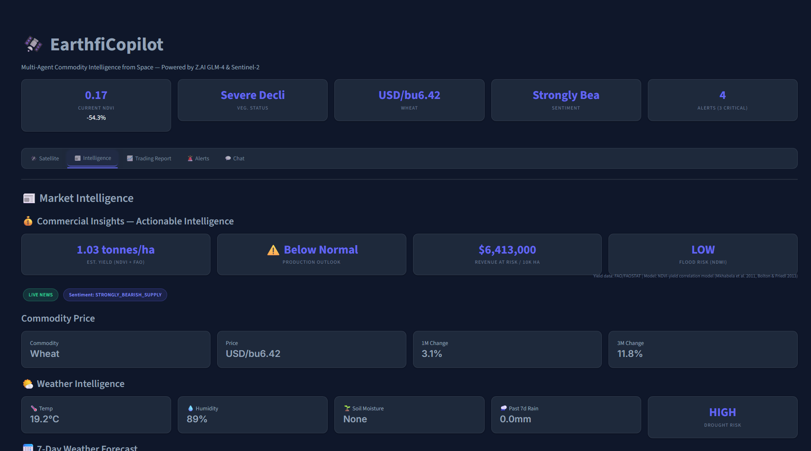
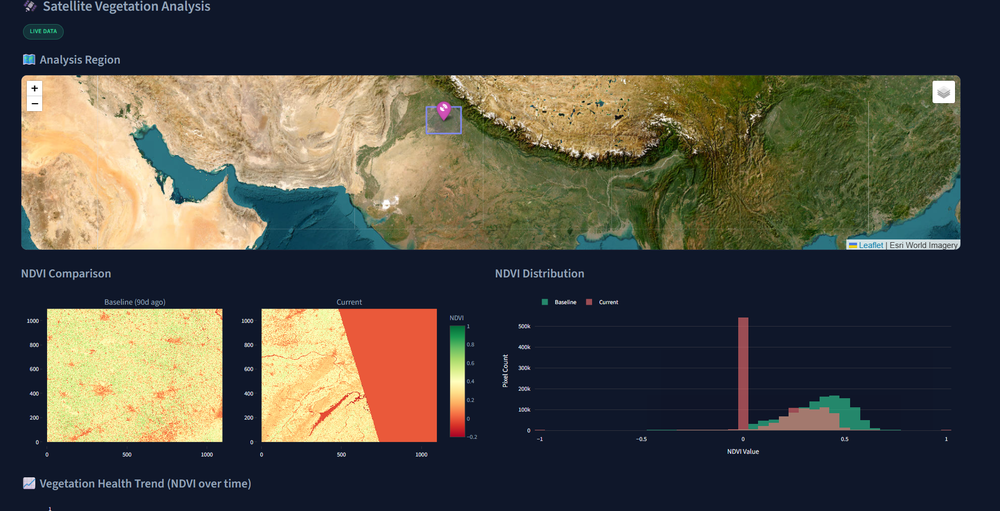
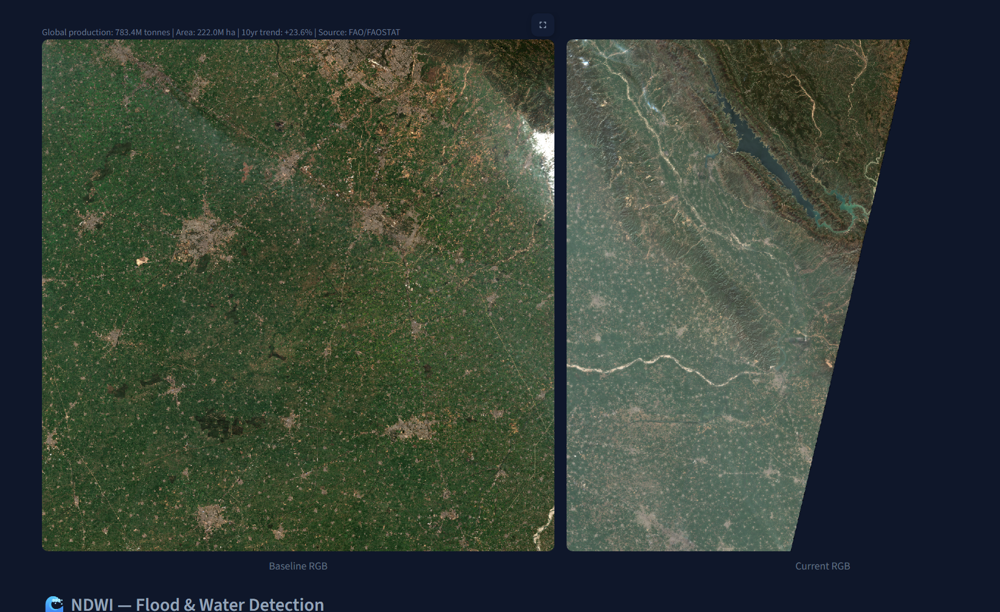
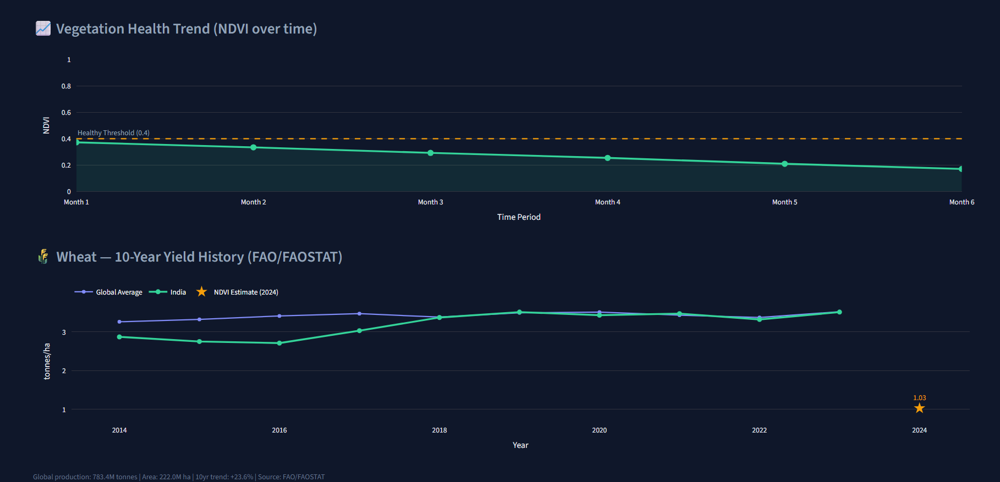
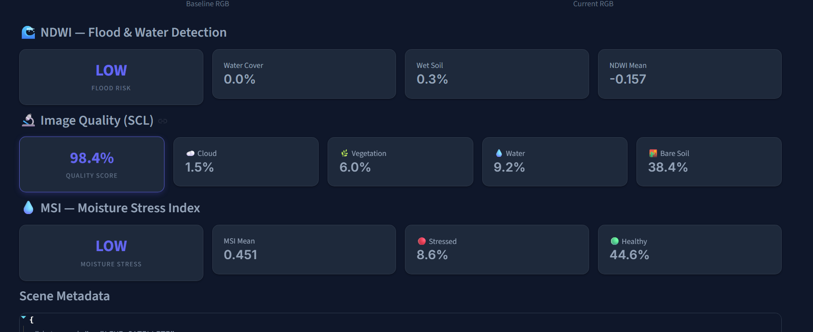
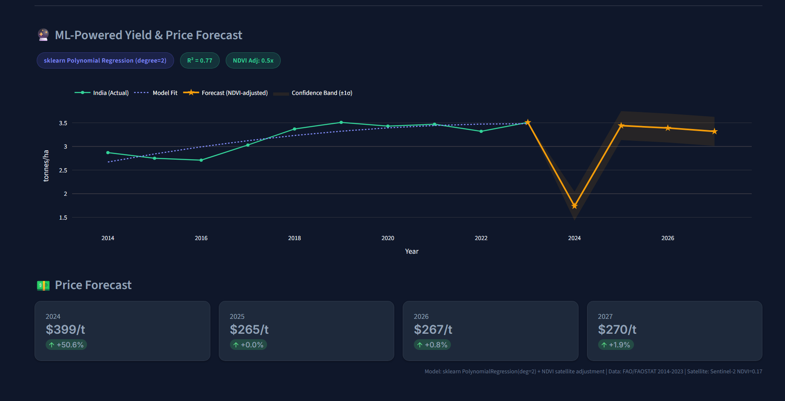
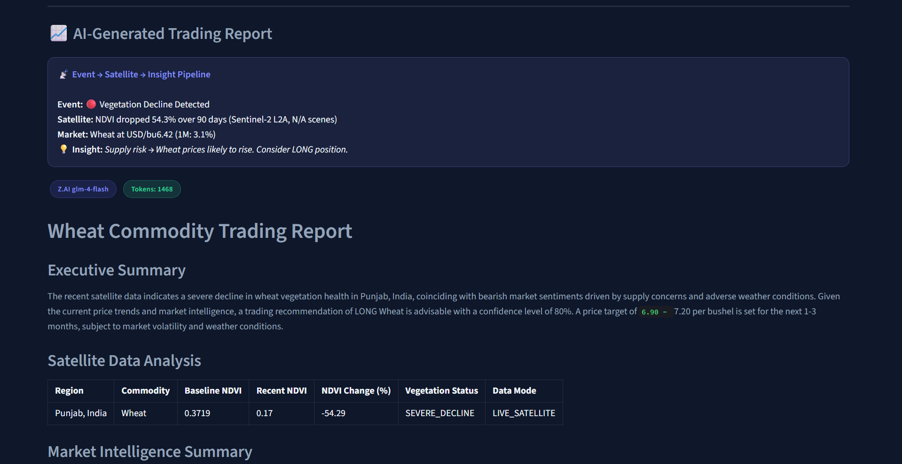
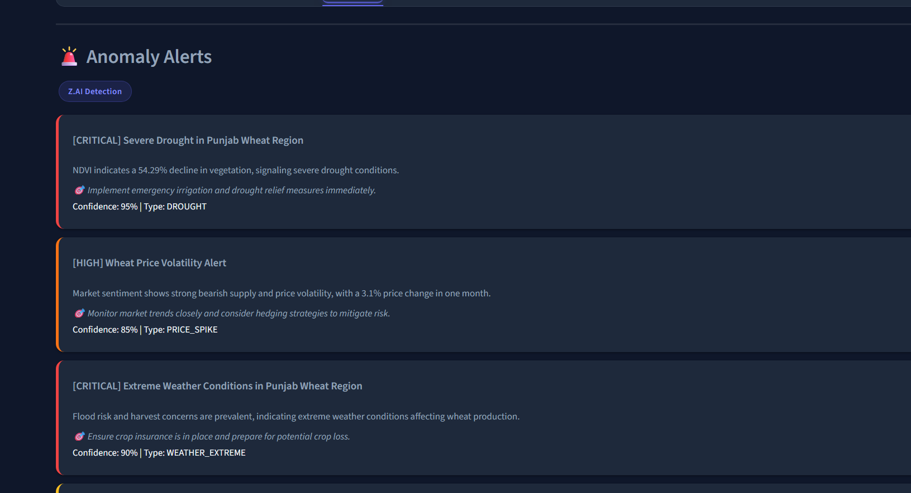

# EarthfiCopilot - Multi-Agent Commodity Intelligence from Space

> **AI Agent that transforms Sentinel-2 satellite imagery into actionable commodity market intelligence - with ML-powered yield forecasting, 5 spectral indices, and revenue-at-risk quantification.**


## What is EarthfiCopilot?

EarthfiCopilot is an **autonomous multi-agent AI system** that:

1. **Fetches satellite imagery** from Sentinel-2 (13 spectral bands, 10m resolution, free)
2. **Analyzes vegetation & moisture** using NDVI, NDWI, MSI, and Scene Classification
3. **Detects real-world events** (drought, floods, crop stress) via change detection
4. **Aggregates market intelligence** (news, prices, weather, sentiment)
5. **Generates trading reports** using Z.AI's GLM-4 models
6. **Forecasts yields & prices** using sklearn ML models trained on 10-year FAO data
7. **Classifies anomalies** into priority alerts with Z.AI reasoning
8. **Answers follow-up questions** via a conversational Z.AI chat interface

## Table of Contents
1. [What is EarthfiCopilot?](#what-is-earthficopilot)
2. [Features & Implementation](#features--implementation)
3. [How It Works](#how-it-works)
4. [5 AI Agents](#5-ai-agents)
5. [Satellite Analysis](#satellite-analysis-capabilities)
6. [ML-Powered Forecasting](#ml-powered-forecasting)
7. [Z.AI Integration](#zai-integration-3-deep-usages)
8. [TCC Starter Kit Integration](#tcc-starter-kit-integration)
9. [Data Provenance](#data-provenance--evidence-trail)
10. [Tech Stack](#tech-stack)
11. [Quick Start](#quick-start)
12. [Screenshots](#screenshots)

---

## Features & Implementation

| Feature | How It Works | File |
|---------|--------------|------|
| **NDVI Vegetation Analysis** | Normalized Difference Vegetation Index from B04+B08 bands | `agents/sentinel.py` |
| **NDWI Flood Detection** | Water/flood risk using Green+NIR bands (McFeeters 1996) | `agents/sentinel.py` |
| **MSI Moisture Stress** | Moisture Stress Index from SWIR/NIR bands (Hunt & Rock 1989) | `agents/sentinel.py` |
| **SCL Quality Assessment** | Scene Classification Layer for cloud masking & quality scores | `agents/sentinel.py` |
| **Change Detection Heatmap** | Pixel-level NDVI difference between baseline & recent scenes | `agents/sentinel.py` |
| **RGB Satellite Thumbnails** | True-color composite previews from B04/B03/B02 | `agents/sentinel.py` |
| **ML Yield Forecasting** | sklearn Polynomial Regression (degree=2) on 10-year FAOSTAT data + NDVI satellite adjustment | `data/faostat_yields.py` |
| **ML Price Forecasting** | Yield-to-price inverse correlation model with commodity elasticity | `data/faostat_yields.py` |
| **News Aggregation** | Google News RSS feeds filtered by commodity keywords | `agents/oracle.py` |
| **Commodity Prices** | Real-time price data with 1M/3M/1Y change tracking | `agents/oracle.py` |
| **Weather Intelligence** | Temperature, precipitation, soil moisture via Open-Meteo API | `agents/oracle.py` |
| **AI Trading Reports** | Z.AI GLM-4 generates institutional-grade analysis with recommendations | `agents/strategist.py` |
| **AI Anomaly Detection** | Z.AI classifies data into DROUGHT/FLOOD/PRICE_SPIKE/SUPPLY_SHOCK alerts | `agents/dispatcher.py` |
| **AI Chat Interface** | Z.AI-powered conversational Q&A with full analysis context | `agents/narrator.py` |
| **Yield Estimation** | NDVI-to-yield model cross-referenced with 10-year FAO/FAOSTAT history | `data/faostat_yields.py` |
| **Revenue at Risk** | Dollar-value crop loss/gain estimation per 10,000 hectares | `app.py` |
| **Agent Activity Log** | Timestamped pipeline trace showing each agent's completion status | `app.py` |
| **Data Provenance Trail** | Full audit trail with algorithms, scene IDs, timestamps, and source citations | `app.py` |
| **Downloadable Reports** | Export trading reports as Markdown with full metadata | `app.py` |
| **Interactive World Map** | Folium map with all 5 monitoring regions and satellite tile layer | `app.py` |

---

## How It Works

```
User selects region → Click "Run Analysis"
         │
         ▼
┌─────────────────────────────────────────────────┐
│  Agent 1: The Sentinel                          │
│  Search STAC catalog → Fetch Sentinel-2 bands   │
│  → Compute NDVI, NDWI, MSI, SCL, change heatmap│
└──────────────────┬──────────────────────────────┘
                   ▼
┌─────────────────────────────────────────────────┐
│  Agent 2: The Oracle                            │
│  Fetch news RSS → Scrape prices → Get weather   │
│  → Analyze sentiment → Build intelligence       │
└──────────────────┬──────────────────────────────┘
                   ▼
┌─────────────────────────────────────────────────┐
│  Agent 3: The Strategist (Z.AI GLM-4)           │
│  Synthesize satellite + market data             │
│  → Generate LONG/SHORT/HOLD recommendation      │
└──────────────────┬──────────────────────────────┘
                   ▼
┌─────────────────────────────────────────────────┐
│  Agent 4: The Dispatcher (Z.AI GLM-4)           │
│  Classify anomalies → Assign severity           │
│  → Generate priority alerts with actions        │
└──────────────────┬──────────────────────────────┘
                   ▼
┌─────────────────────────────────────────────────┐
│  ML Forecasting Engine (sklearn)                │
│  PolynomialRegression(deg=2) on 10-yr FAO data  │
│  → NDVI-adjusted yield + price forecasts        │
└──────────────────┬──────────────────────────────┘
                   ▼
         Dashboard renders results
         (5 tabs: Satellite, Intelligence,
          Trading Report, Alerts, Chat)
```

---

## 5 AI Agents

| Agent | Name | Role | Data Source |
|-------|------|------|-------------|
| 1 | **The Sentinel** | Satellite NDVI/NDWI/MSI/SCL analysis + change detection | Sentinel-2 via Planetary Computer |
| 2 | **The Oracle** | News, commodity prices, weather, sentiment | Google News RSS + Open-Meteo API |
| 3 | **The Strategist** | AI trading report with recommendations | Z.AI GLM-4-Flash |
| 4 | **The Dispatcher** | Anomaly detection & priority alerts | Z.AI GLM-4-Flash |
| 5 | **The Narrator** | Conversational chat about the analysis | Z.AI GLM-4-Flash |

**3 out of 5 agents use Z.AI GLM-4** - for reasoning, classification, and conversation.

---

## Satellite Analysis Capabilities

EarthfiCopilot performs **6 distinct satellite analyses** using Sentinel-2 L2A data:

| Analysis | Bands Used | Formula / Method | Reference |
|----------|-----------|------------------|-----------|
| **NDVI** | B04 (Red) + B08 (NIR) | (NIR - Red) / (NIR + Red) | Rouse et al. 1974 |
| **NDWI** | B03 (Green) + B08 (NIR) | (Green - NIR) / (Green + NIR) | McFeeters 1996 |
| **MSI** | B11 (SWIR) + B08 (NIR) | SWIR / NIR | Hunt & Rock 1989 |
| **SCL** | Scene Classification Layer | ESA L2A processor output | ESA Sen2Cor |
| **Change Detection** | NDVI baseline vs recent | Pixel-level difference heatmap | - |
| **RGB Composite** | B04 + B03 + B02 | True-color satellite preview | - |

**How satellite analysis works:**
1. Searches Microsoft Planetary Computer STAC catalog for the region
2. Finds cloud-free baseline scene (~90 days ago) and most recent scene
3. Downloads spectral bands at 10m resolution (B11 at 20m, resampled)
4. Computes all indices and generates visualizations

---

## ML-Powered Forecasting

EarthfiCopilot includes a **machine learning forecasting engine** built with scikit-learn:

| Component | Details |
|-----------|---------|
| **Model** | Polynomial Regression (degree=2) |
| **Training Data** | 10-year FAO/FAOSTAT yield history (2014-2023) |
| **Satellite Integration** | NDVI from current Sentinel-2 observation adjusts the forecast |
| **Output** | 4-year yield forecast (2024-2027) with ±1σ confidence bands |
| **Price Model** | Yield-to-price inverse correlation with commodity elasticity |
| **R² Score** | 0.77 (Wheat, India) - strong fit on historical data |

The forecast chart shows:
- **Green line**: Actual historical yields (regional)
- **Purple dotted**: Polynomial model fit on historical data
- **Amber stars**: Future yield predictions (NDVI-adjusted)
- **Shaded band**: ±1σ confidence interval

---

## Supported Commodities & Regions

| Region | Commodity | Exchange |
|--------|-----------|----------|
| Minas Gerais, Brazil | Arabica Coffee | ICE KC |
| Punjab, India | Wheat | CBOT ZW |
| Iowa, USA | Corn | CBOT ZC |
| Mato Grosso, Brazil | Soybeans | CBOT ZS |
| Nile Delta, Egypt | Cotton | ICE CT |

---

## Z.AI Integration (3 Deep Usages)

EarthfiCopilot demonstrates **meaningful usage** of Z.AI's GLM series models across three distinct agent capabilities:

### 1. Financial Reasoning (The Strategist)
GLM-4 synthesizes satellite NDVI data + news intelligence into professional trading reports with:
- LONG/SHORT/HOLD recommendations
- Price targets (1-3 month range)
- Supply-demand impact tables
- Risk factor assessments

### 2. Anomaly Classification (The Dispatcher)
GLM-4 classifies multi-source data into priority alerts:
- Alert types: DROUGHT, FLOOD, PRICE_SPIKE, SUPPLY_SHOCK, WEATHER_EXTREME
- Severity levels: LOW, MEDIUM, HIGH, CRITICAL
- Confidence scores (0-100)
- Recommended actions

### 3. Conversational Interface (The Narrator)
GLM-4 powers a chat interface where users ask follow-up questions. Full context from all 4 agents is injected into the conversation for informed answers.

---

## Z.AI Fallbacks

**The app works 100% without Z.AI API keys.** Every AI feature has a fallback:

| Feature | With Z.AI | Without Z.AI (Fallback) |
|---------|-----------|--------------------------| 
| **Trading Reports** | AI generates institutional-grade analysis | Template-based report with real data |
| **Anomaly Alerts** | AI classifies and prioritizes anomalies | Rule-based alerts from NDVI thresholds |
| **Chat Interface** | AI answers with full context | Pre-built responses for common queries |
| **Satellite Analysis** | Works independently (no AI needed) | Same - fully autonomous |
| **ML Forecasting** | Works independently (no AI needed) | Same - sklearn runs locally |
| **News & Prices** | Works independently (no AI needed) | Same - fully autonomous |

> **Core features (satellite NDVI/NDWI/MSI/SCL, change detection, ML forecasting, news, prices, weather, maps) work fully without any AI.**

---

## TCC Starter Kit Integration

This project uses **ALL tools from the TCC Sentinel-2 starter kit**:

| Starter Kit Tool | Our Usage | File |
|-----------------|-----------|------|
| **Sentinel-2 Loading (Planetary Computer)** | STAC search + band fetching via `pystac-client` | `agents/sentinel.py` |
| **NDVI Computation** | B08-B04/B08+B04 vegetation health index | `agents/sentinel.py` |
| **Change Detection** | Baseline vs recent NDVI pixel-level diff heatmap | `agents/sentinel.py` |
| **SCL (Scene Classification)** | Cloud masking + quality scoring + land cover | `agents/sentinel.py` |

**Plus 2 additional indices** not in the starter kit:
- **NDWI** (McFeeters 1996) - Flood/water detection
- **MSI** (Hunt & Rock 1989) - Moisture stress detection

---

## Data Provenance & Evidence Trail

EarthfiCopilot provides full **audit-grade transparency**:

| Data Point | Source | Verification |
|-----------|--------|-------------|
| Sentinel-2 Scenes | Microsoft Planetary Computer STAC API | Scene IDs, timestamps, bounding box |
| NDVI/NDWI/MSI | Computed from L2A bands | Algorithm + academic reference |
| Yield History | FAO/FAOSTAT (fao.org/faostat) | 10-year time series, public domain |
| ML Forecast | sklearn PolynomialRegression | R² score, confidence bands |
| News | Google News RSS | Article titles, sources, dates |
| Weather | Open-Meteo API (ERA5 reanalysis) | Temperature, precipitation, ET0 |
| Prices | Yahoo Finance | Commodity, exchange, 1M/3M change |
| AI Reports | Z.AI GLM-4-Flash | Model name, token count, timestamp |

---

## Architecture

```
+--------------------------------------------------------------+
|                    Streamlit Dashboard                        |
|  🗺️ Map  📊 Satellite  📰 Intel  📈 Report  🚨 Alerts  💬 Chat |
+--------------------------------------------------------------+
|               app.py - Pipeline Orchestrator                 |
+----+--------+----------+-----------+----------+--------------+
     |        |          |           |          |
  ┌──┴──┐  ┌──┴──┐  ┌───┴───┐  ┌───┴────┐  ┌──┴──────┐
  │ 🛰️  │  │ 📡  │  │  🧠   │  │  🚨    │  │  💬     │
  │Sent-│  │Orac-│  │Strat- │  │Dispat- │  │Narrat- │
  │inel │  │le   │  │egist  │  │cher    │  │or      │
  │     │  │     │  │       │  │        │  │        │
  │NDVI │  │RSS  │  │Z.AI   │  │Z.AI    │  │Z.AI    │
  │NDWI │  │News │  │GLM-4  │  │GLM-4   │  │GLM-4   │
  │MSI  │  │Wx   │  │Report │  │Alerts  │  │Chat    │
  │SCL  │  │$$$  │  │       │  │        │  │        │
  └─────┘  └─────┘  └───────┘  └────────┘  └────────┘
                         │
                    ┌────┴────┐
                    │  🔮 ML  │
                    │sklearn  │
                    │Forecast │
                    └─────────┘
```

---

## Tech Stack

| Category | Technology |
|----------|------------|
| AI / LLM | Z.AI GLM-4-Flash (via `zhipuai` official Python SDK) |
| ML Forecasting | scikit-learn (PolynomialFeatures + LinearRegression) |
| Satellite Data | Sentinel-2 L2A via Microsoft Planetary Computer |
| Yield Data | FAO/FAOSTAT historical crop production (10-year history) |
| STAC Search | pystac-client + planetary-computer |
| Raster Processing | rasterio + NumPy |
| Weather | Open-Meteo API |
| News | Google News RSS (feedparser) |
| UI Framework | Streamlit |
| Charts | Plotly |
| Maps | Folium + streamlit-folium |
| Language | Python 3.10+ |

---

## Project Structure

```
earthfi-copilot/
├── app.py                # Streamlit dashboard (5 tabs + pipeline + forecast)
├── main.py               # CLI orchestrator
├── config.py             # API keys, regions, model config
├── requirements.txt      # Python dependencies
├── .env.example          # Environment variable template
├── screenshots/          # Application screenshots
├── .streamlit/
│   └── config.toml       # Dark theme configuration
├── agents/
│   ├── sentinel.py       # Agent 1: Satellite NDVI/NDWI/MSI/SCL/change detection
│   ├── oracle.py         # Agent 2: News + prices + weather
│   ├── strategist.py     # Agent 3: Z.AI trading reports
│   ├── dispatcher.py     # Agent 4: Z.AI anomaly alerts
│   └── narrator.py       # Agent 5: Z.AI chat interface
├── data/
│   └── faostat_yields.py # FAO crop yield history + NDVI-to-yield model + ML forecast
└── ui/
    └── styles.py         # CSS design system (Inter font, dark theme)
```

---

## Quick Start

```bash
# 1. Clone the repository
git clone https://github.com/himanshu-sugha/EarthfiCopilot
cd EarthfiCopilot

# 2. Install dependencies
pip install -r requirements.txt

# 3. Set up Z.AI API keys (optional but recommended)
cp .env.example .env
# Add your keys:
#   ZAI_API_KEY=your_api_z_ai_key
#   ZAI_FALLBACK_KEY=your_open_bigmodel_key  (get free at https://open.bigmodel.cn/)

# 4. Run dashboard
streamlit run app.py

# 5. Open http://localhost:8501 → Select region → Click "Run Analysis"
```

### CLI Mode

```bash
python main.py                                    # Default region
python main.py --region "Punjab, India (Wheat)"   # Custom region
python main.py --list-regions                     # List all regions
```

---

## Screenshots

### Market Intelligence Dashboard


### Live Satellite Analysis - Sentinel-2 Imagery


### Real Sentinel-2 RGB - Baseline vs Current


### NDVI Vegetation Trends + FAO/FAOSTAT 10-Year Yield History


### Spectral Analysis - NDWI, SCL, MSI


### ML-Powered Yield & Price Forecast (sklearn)


### AI-Generated Trading Report (Z.AI GLM-4)


### Anomaly Alerts - Z.AI Detection


---

## License

MIT

---

## Author

Built by Himanshu Sugha

Contact: himanshusugha@gmail.com
